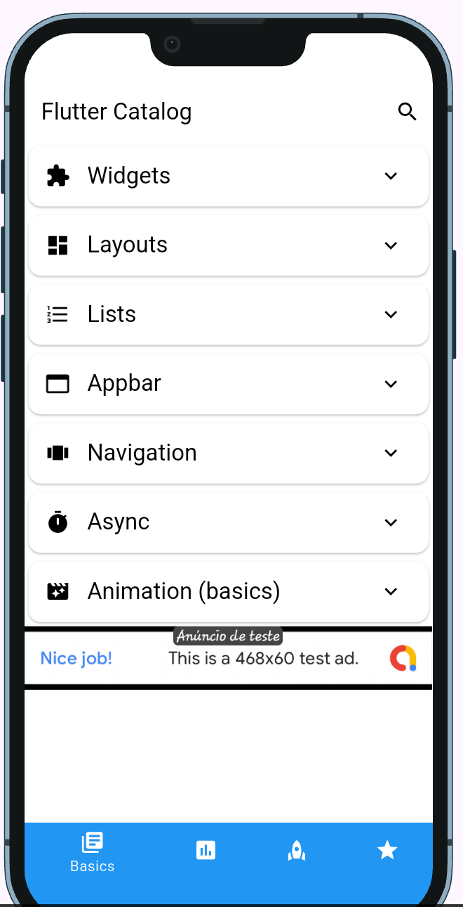
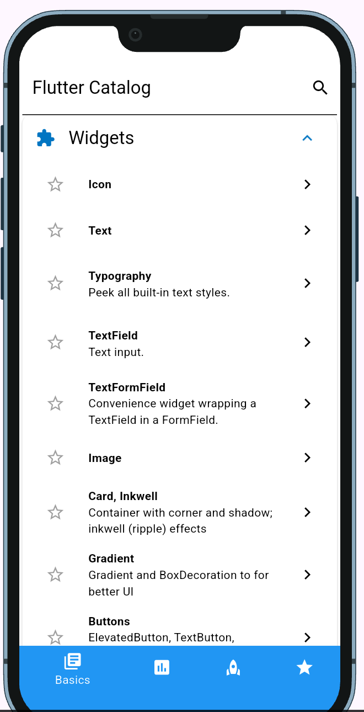
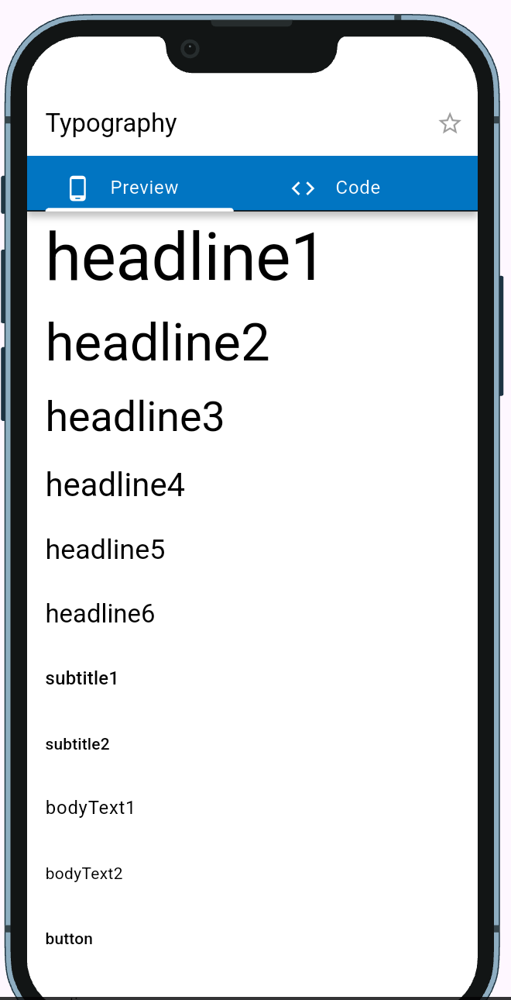
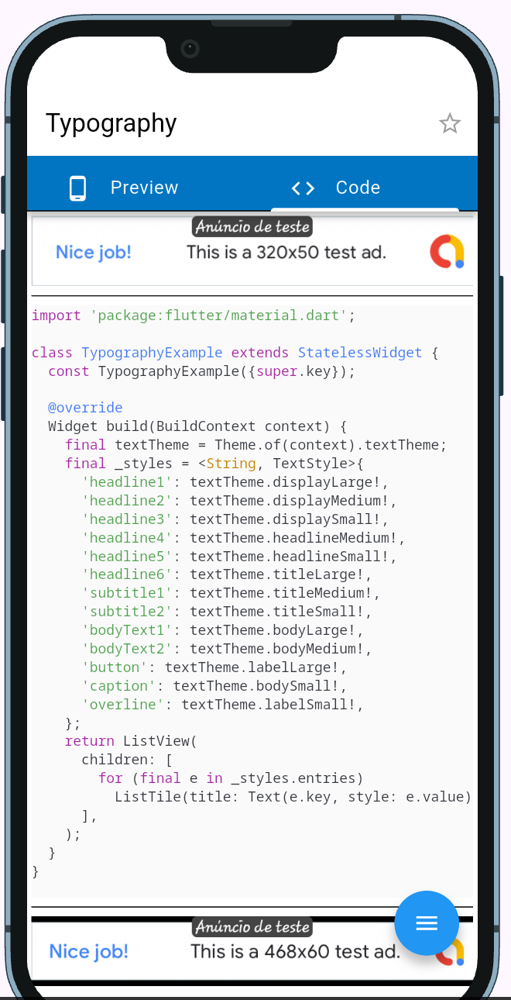
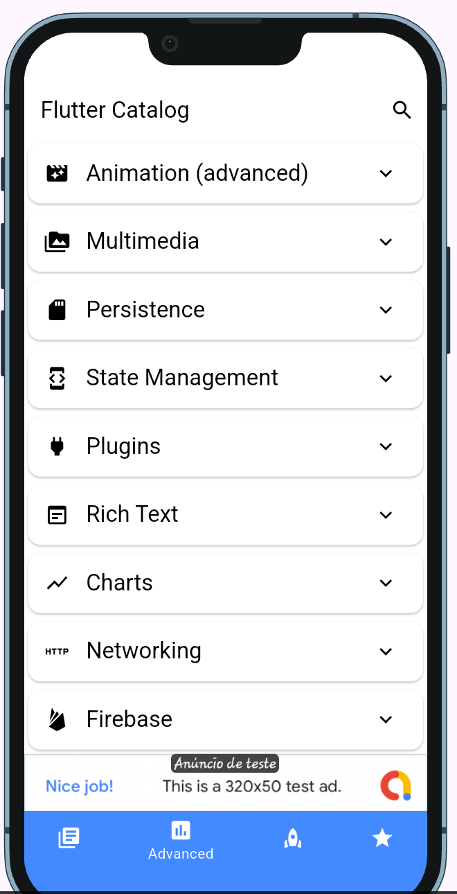
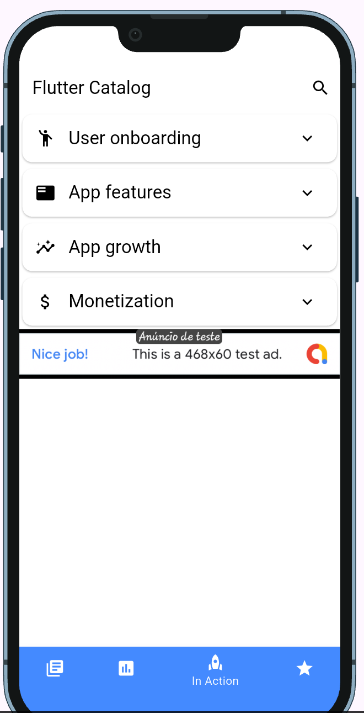
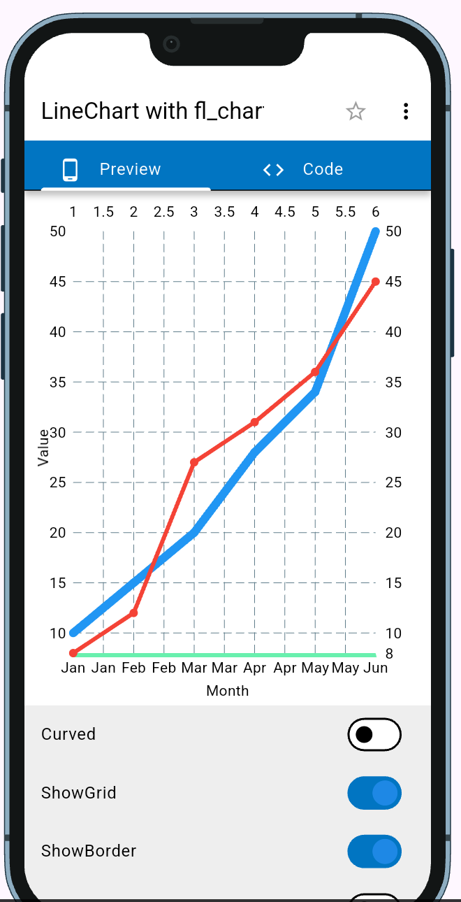
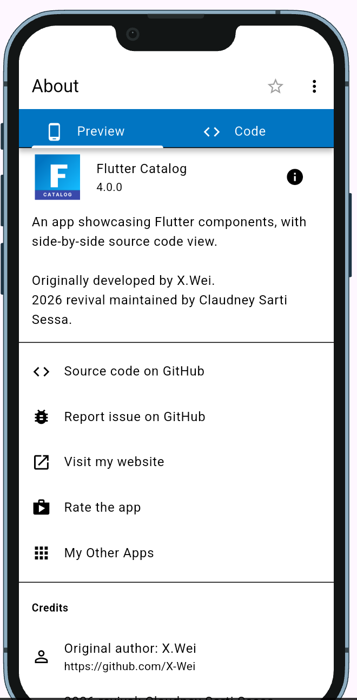
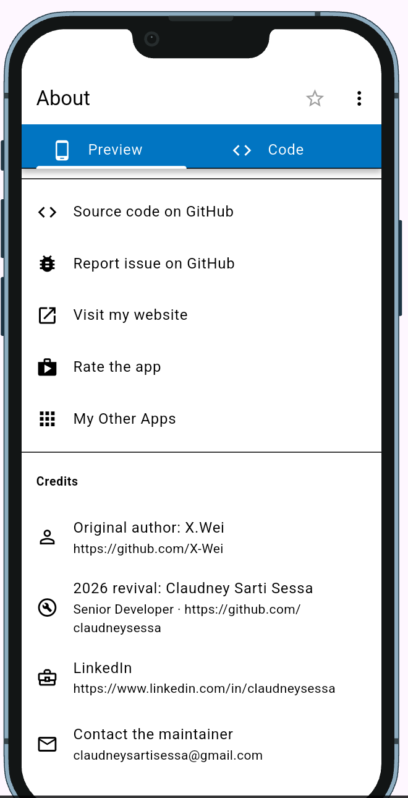

# Flutter Catalog

[](https://docs.flutter.dev/release/release-notes)
[](https://dart.dev/guides/language/evolution)
[](#build-status)
[](test)
[](LICENSE)
[](https://github.com/claudneysessa/flutter_catalog/commits/master)

An app showcasing Flutter components, with a side-by-side source code view.
115 runnable examples across 20 groups — widgets, layouts, lists, navigation,
animations, charts, state management, persistence, networking, Firebase,
monetization and more. Every example screen has a **Code** tab that renders the
exact source file behind it, with syntax highlighting and a link to the file on
GitHub.

> **This is a maintained fork.** The original project by
> [X.Wei](https://github.com/X-Wei) stopped receiving updates and no longer
> compiled with current toolchains. This fork brings it back to life on
> Flutter 3.44 / Dart 3, keeping the original license and authorship intact.
>
> **2026 revival maintained by Claudney Sarti Sessa**<br>
> Senior Developer<br>
> [claudneysartisessa@gmail.com](mailto:claudneysartisessa@gmail.com)<br>
> [linkedin.com/in/claudneysessa](https://www.linkedin.com/in/claudneysessa)<br>
> [github.com/claudneysessa](https://github.com/claudneysessa)

## Preview

Captured on a physical Samsung SM X510 tablet running Android 16, through the
app's own `device_preview` frame.

| Home | Widgets group | Typography example |
| ------------------ | --------------------------- | ------------------ |
|  |  |  |

| Side-by-side source code | Advanced tab | In Action tab |
| ------------------ | --------------------------- | ------------------ |
|  |  |  |

| Charts (fl_chart) | About | Credits |
| ------------------ | --------------------------- | ------------------ |
|  |  |  |

> The Edge Detection example and the deprecated Heatmap Calendar example were
> removed during the 2026 migration and are no longer part of the app.

## Build status

App version **4.0.0+99**, revived on **2026-08-14** by
[Claudney Sarti Sessa](https://www.linkedin.com/in/claudneysessa).

| Component | Before (2023) | Now |
| --- | --- | --- |
| Flutter | 3.7.5 (beta channel metadata) | **3.44.6** (stable) |
| Dart | 2.19.2 | **3.12.2** |
| Gradle | 7.2 | **8.14.3** |
| Android Gradle Plugin | 7.1.3 | **8.13.0** |
| Kotlin | 1.9.10 | **2.2.20** |
| Java / JVM target | 8 | **17** |
| Android `compileSdk` / `targetSdk` | 34 | **36** |
| Android `minSdk` | 21 | **24** |
| Gradle DSL | Groovy | Kotlin DSL |
| Firebase (core / auth / firestore) | 2.32 / 4.16 / 4.17 | **4.13 / 6.5 / 6.8** |
| Riverpod | 2.x | **3.4** |
| Release APK | did not build | **196 MB** universal (~70 MB per ABI) |

Verified on this revival:

| Check | Result |
| --- | --- |
| `flutter analyze` | No errors, no warnings |
| `flutter test` | 18/18 passing |
| `flutter build apk --debug` | Success |
| `flutter build apk --release` | Success (R8 + resource shrinking on) |
| Runtime | Running on a physical Android 16 device |

## What changed in the 2026 revival

`flutter pub get` failed on dependency resolution, and 117 compilation errors
waited behind it. High level summary — see [CHANGELOG.md](CHANGELOG.md) for the
full list:

- **Dependency graph rebuilt.** The whole Firebase stack was pinned two majors
  behind by the discontinued `flutterfire_ui`; replacing it with
  `firebase_ui_auth` + `firebase_ui_oauth_google` unblocked Firebase 4.x.
  `flutter_markdown` → `flutter_markdown_plus`, `hive`/`hive_generator` →
  `hive_ce`/`hive_ce_generator`.
- **Riverpod 3.** `ChangeNotifierProvider`, `StateProvider` and
  `StateNotifierProvider` moved to `package:flutter_riverpod/legacy.dart`.
- **Android toolchain regenerated**: Gradle 8.14, AGP 8.13, Kotlin 2.2, Kotlin
  DSL, Java 17, declarative plugin block, `namespace`, manifest cleaned of the
  removed `package` attribute and updated for scoped storage and package
  visibility.
- **Flutter API updates**: `ThemeData.toggleableActiveColor` / `backgroundColor`
  / `errorColor` removed, `ButtonBar` → `OverflowBar`, `withOpacity` →
  `withValues`, `showBottomSheet` type argument dropped.
- **Package API updates**: `super_editor` (`DocumentEditor` → `Editor`),
  `chat_gpt_sdk` 3, `share_plus` (`SharePlus.instance.share`), `local_auth` 3,
  `fl_chart` tooltip callbacks, `graphview` configuration object,
  `extended_image` rotation, `firebase_ui_auth` providers.
- **Release APK cut from 334 MB to 196 MB** by replacing the `google_ml_kit`
  umbrella package — which bundles every ML Kit model, including translation and
  digital ink — with only the four feature packages the demo actually uses.
- **`animated_radial_menu` vendored** under `packages/`: upstream pins
  `font_awesome_flutter` 9.x, which no longer compiles because it extends the
  now-`final` `IconData` class.
- **Test suite added** (18 unit and widget tests) covering the routing table
  integrity, the themes and a set of example widgets.
- **Every link that pointed at the original repository now points at this
  fork**, and the About screen gained a Credits section naming both the original
  author and the fork maintainer.

Removed along the way: `edge_detection` (unmaintained, incompatible Android
build), the deprecated `heatmap_calendar` git dependency (the maintained
`flutter_heatmap_calendar` example stays) and `material_buttonx` (reads the
removed `TextTheme.headline6`).

Supported platforms: **Android and iOS**. iOS was not rebuilt on the machine
used for the migration (Windows) — verify it on macOS before shipping.

## Getting Started

Requirements: Flutter 3.35 or newer (validated on 3.44.6), Dart 3.9+, JDK 17+
and the Android SDK for Android builds.

Firebase is required to run the app: create a project in the Firebase console
and provide your own configuration files.

- `android/app/google-services.json`
- `lib/firebase_options.dart`
- `.firebaserc`, `firebase.json`, `firestore.indexes.json`, `firestore.rules`

```bash
flutter pub get
dart run build_runner build   # regenerates the freezed/hive *.g.dart files
flutter analyze
flutter test
flutter run                   # or: flutter build apk --release
```

## Contribute

Adding a new example page:

1. Create a dart file under `lib/routes/` (or duplicate one, e.g.
   `cp lib/routes/widgets_icon_ex.dart lib/routes/new_example.dart`);
2. In the new file, create an example widget;
3. In `my_app_routes.dart`, add a new `MyRoute` entry, with `child` being the
   example widget from the last step;
4. Add the other metadata — `sourceFilePath`, `title`, `description`, `links`;
5. Run `flutter test` (the routing table is covered by tests) and try the app;
6. Open a pull request.

See [CONTRIBUTING.md](CONTRIBUTING.md) for the release steps.

## Questions?🤔

**About this fork** — Claudney Sarti Sessa

[claudneysartisessa@gmail.com](mailto:claudneysartisessa@gmail.com) · [linkedin.com/in/claudneysessa](https://www.linkedin.com/in/claudneysessa) · [github.com/claudneysessa](https://github.com/claudneysessa)

**About the original project** — X.Wei

[github.com/X-Wei](https://github.com/X-Wei)

## Support the original author

> If this project helped you, the credit for it belongs to
> [X.Wei](https://github.com/X-Wei). Star
> [the original repository](https://github.com/X-Wei/flutter_catalog) — that is
> where the app and every example in it came from.

## Maintainers

| Role | Who |
| --- | --- |
| Original author | [X.Wei](https://github.com/X-Wei) — created the project and every example in it |
| Fork maintainer (2026 revival) | **Claudney Sarti Sessa**, Senior Developer — [email](mailto:claudneysartisessa@gmail.com) · [LinkedIn](https://www.linkedin.com/in/claudneysessa) · [GitHub](https://github.com/claudneysessa) |

The 2026 revival covers the Flutter 3.44 / Dart 3 migration, the Android
toolchain upgrade, the dependency rebuild, the test suite and the
[CHANGELOG](CHANGELOG.md). Credit for the app itself and for its examples
belongs to the original author and to the contributors listed below.

## License

**MIT**, `Copyright (c) 2018 xwei` — see [LICENSE](LICENSE) for the full text.
This fork keeps the license and the original copyright notice unchanged; changes
made during the 2026 revival are contributed under those same terms.

## Credits

This app was built with inspiration from several sources, including:

- [Official Flutter Gallery App](https://github.com/flutter/gallery)
- [Andrea Bizzotto's YouTube Channel](https://www.youtube.com/channel/UCrTnsT4OYZ53l0QGKqLeD5Q)
- [Tensor Programming's YouTube Channel](https://www.youtube.com/watch?v=WwhyaqNtNQY&list=PLJbE2Yu2zumDqr_-hqpAN0nIr6m14TAsd)
- [Eajy's Flutter Demo](https://github.com/Eajy/flutter_demo)

## Contributors ✨

Thanks goes to these wonderful people:

<!-- ALL-CONTRIBUTORS-LIST:START - Do not remove or modify this section -->
<!-- prettier-ignore-start -->
<!-- markdownlint-disable -->
<table>
  <tbody>
    <tr>
      <td align="center" valign="top" width="50%"><a href="https://github.com/X-Wei"><br /><sub><b>X.Wei</b></sub></a><br /><sub>Original author</sub></td>
      <td align="center" valign="top" width="50%"><a href="https://github.com/claudneysessa"><br /><sub><b>Claudney Sarti Sessa</b></sub></a><br /><sub>2026 revival</sub></td>
    </tr>
  </tbody>
</table>

<!-- markdownlint-restore -->
<!-- prettier-ignore-end -->

<!-- ALL-CONTRIBUTORS-LIST:END -->

This project follows the [all-contributors](https://github.com/all-contributors/all-contributors) specification. Contributions of any kind welcome!
